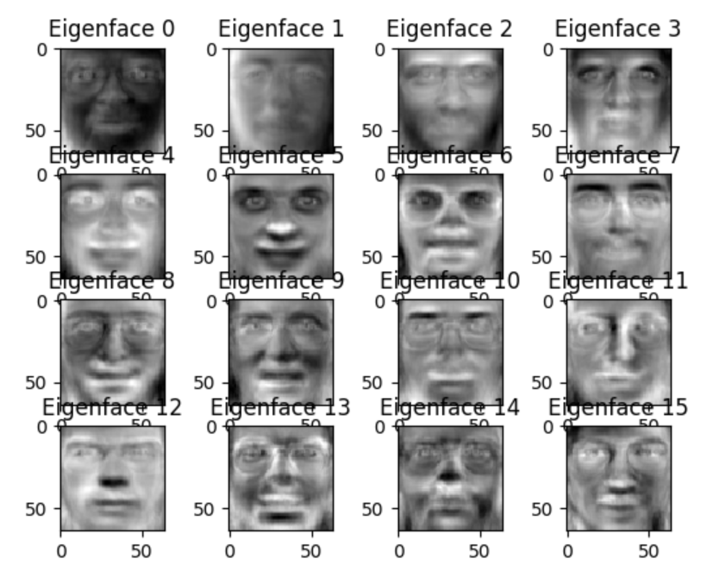

# PCA_Eigenfaces
Apply Principle Component Analysis on Human Faces

## Introduction
I used the [Olivetti face dataset](http://www.cl.cam.ac.uk/research/dtg/attarchive/facedatabase.html). 
It is included on the repo as "faces.csv"

The data contains 400 face images of size 64 x 64. In faces.csv, each row represents a face image. The first 64 values
represent the rst column of the image, and the next 64 values represent the second column and so on.

## Results
- First Face

- Average Face (Mean of all features)

- First 16 Eigenfaces Face (16 eigenvectors with highest eigenvalues)

- Reconstruction of the first face using 5 principle components

- Reconstruction of the first face using 10 principle components

- Reconstruction of the first face using 25 principle components

- Reconstruction of the first face using 100 principle components

- Reconstruction of the first face using 399 principle components

- Percentage of variance contributed to number of principle components

